# SkillSync — Use Case Analysis & Use Case Diagram

> **Document Type:** Use Case Analysis | **Version:** 1.0 | **Date:** 2026-05-10

---

## 1. Actor Identification

| Actor | Role | Permissions |
|---|---|---|
| **Guest / Visitor** | Unauthenticated browser | View landing page, register, login |
| **Learner** | Registered user learning skills | Browse mentors, book sessions, join groups, make payments, write reviews |
| **Mentor** | Approved skill instructor | Manage profile, set availability, accept/reject sessions, view earnings |
| **Admin** | Platform super-user | Manage all users, approve/reject mentors, manage skills & groups |

> **Note:** Roles are persisted as `ROLE_LEARNER`, `ROLE_MENTOR`, `ROLE_ADMIN` in `auth.users`. The system enforces RBAC at the API Gateway and service layer. A user transitions from Learner → Mentor only after explicit Admin approval of a mentor application.

---

## 2. Use Case Diagram

```mermaid
graph TD
    subgraph "SkillSync System Boundary"
        
        subgraph "Authentication Module"
            UC1["Register Account"]
            UC2["Initiate Registration\n(OTP)"]
            UC3["Verify OTP"]
            UC4["Login"]
            UC5["OAuth Login\n(Google)"]
            UC6["Refresh Token"]
            UC7["Logout"]
            UC8["Forgot Password"]
            UC9["Reset Password"]
            UC10["Setup Password\n(OAuth users)"]
        end

        subgraph "Profile Module"
            UC11["View Own Profile"]
            UC12["Update Profile"]
        end

        subgraph "Mentor Discovery"
            UC13["Browse/Search Mentors"]
            UC14["View Mentor Detail"]
            UC15["View Mentor Reviews"]
            UC16["View Mentor Availability"]
        end

        subgraph "Session Module"
            UC17["Book Session"]
            UC18["View My Sessions"]
            UC19["Accept Session"]
            UC20["Reject Session"]
            UC21["Cancel Session"]
            UC22["Complete Session"]
        end

        subgraph "Review Module"
            UC23["Submit Review"]
            UC24["View My Reviews Given"]
        end

        subgraph "Payment Module"
            UC25["Initiate Payment\n(Razorpay Order)"]
            UC26["Verify Payment\n(Signature)"]
            UC27["View Payment History"]
        end

        subgraph "Mentor Management"
            UC28["Apply as Mentor"]
            UC29["Manage Availability Slots"]
            UC30["View Earnings"]
            UC31["View Mentor Dashboard"]
        end

        subgraph "Group Module"
            UC32["Browse Groups"]
            UC33["Create Group"]
            UC34["Join Group"]
            UC35["Leave Group"]
            UC36["Post Discussion"]
            UC37["Delete Discussion"]
            UC38["Manage Group Members"]
        end

        subgraph "Notification Module"
            UC39["View Notifications"]
            UC40["Mark Notification Read"]
            UC41["Receive Real-Time\nNotifications (WS)"]
        end

        subgraph "Admin Module"
            UC42["View Admin Dashboard\n(Stats)"]
            UC43["Manage Users\n(View/Role/Delete)"]
            UC44["Approve Mentor\nApplication"]
            UC45["Reject Mentor\nApplication"]
            UC46["Manage Skills\n(CRUD)"]
            UC47["Manage Groups"]
        end
    end

    Guest(["👤 Guest"])
    Learner(["🎓 Learner"])
    Mentor(["👨‍🏫 Mentor"])
    Admin(["🛡️ Admin"])

    Guest --> UC1
    UC1 -.->|include| UC2
    UC2 -.->|include| UC3
    Guest --> UC4
    Guest --> UC5
    Guest --> UC8
    UC8 -.->|include| UC9

    Learner --> UC4
    Learner --> UC6
    Learner --> UC7
    Learner --> UC10
    Learner --> UC11
    Learner --> UC12
    Learner --> UC13
    Learner --> UC14
    UC14 -.->|include| UC15
    UC14 -.->|include| UC16
    Learner --> UC17
    UC17 -.->|include| UC25
    UC25 -.->|include| UC26
    Learner --> UC18
    UC18 -.->|extend| UC21
    Learner --> UC23
    Learner --> UC24
    Learner --> UC27
    Learner --> UC32
    Learner --> UC34
    Learner --> UC35
    Learner --> UC36
    Learner --> UC39
    Learner --> UC40
    Learner --> UC41
    Learner --> UC28

    Mentor --> UC4
    Mentor --> UC6
    Mentor --> UC7
    Mentor --> UC11
    Mentor --> UC12
    Mentor --> UC19
    Mentor --> UC20
    Mentor --> UC21
    Mentor --> UC22
    UC22 -.->|extend| UC23
    Mentor --> UC29
    Mentor --> UC30
    Mentor --> UC31
    Mentor --> UC32
    Mentor --> UC33
    Mentor --> UC36
    Mentor --> UC37
    Mentor --> UC38
    Mentor --> UC39
    Mentor --> UC40
    Mentor --> UC41

    Admin --> UC42
    Admin --> UC43
    Admin --> UC44
    Admin --> UC45
    Admin --> UC46
    Admin --> UC47
    Admin --> UC33
    Admin --> UC37
    Admin --> UC38
    Admin --> UC39
    Admin --> UC40
```

---

## 3. Actor-to-Use Case Mapping Table

| Use Case | Guest | Learner | Mentor | Admin |
|---|:---:|:---:|:---:|:---:|
| Register Account | ✅ | | | |
| OTP Verification | ✅ | | | |
| Login (Email/OAuth) | ✅ | ✅ | ✅ | ✅ |
| Logout | | ✅ | ✅ | ✅ |
| Token Refresh | | ✅ | ✅ | ✅ |
| Forgot/Reset Password | ✅ | ✅ | ✅ | ✅ |
| Setup Password (OAuth) | | ✅ | ✅ | ✅ |
| View / Edit Profile | | ✅ | ✅ | ✅ |
| Browse / Search Mentors | | ✅ | ✅ | ✅ |
| View Mentor Detail | | ✅ | ✅ | ✅ |
| Book Session | | ✅ | | |
| View My Sessions | | ✅ | ✅ | |
| Accept Session | | | ✅ | |
| Reject Session | | | ✅ | |
| Cancel Session | | ✅ | ✅ | |
| Complete Session | | | ✅ | |
| Submit Review | | ✅ | | |
| View Reviews | | ✅ | ✅ | ✅ |
| Create Razorpay Order | | ✅ | ✅ | |
| Verify Payment | | ✅ | ✅ | |
| View Payment History | | ✅ | ✅ | |
| Apply as Mentor | | ✅ | | |
| Manage Availability | | | ✅ | |
| View Earnings | | | ✅ | |
| Browse / Join Groups | | ✅ | ✅ | ✅ |
| Create Group | | | ✅ | ✅ |
| Post Discussion | | ✅ | ✅ | ✅ |
| Delete Discussion | | | ✅ | ✅ |
| Manage Group Members | | | ✅ | ✅ |
| View Notifications | | ✅ | ✅ | ✅ |
| Mark Notifications Read | | ✅ | ✅ | ✅ |
| Real-Time Notifications (WS) | | ✅ | ✅ | ✅ |
| Admin Dashboard Stats | | | | ✅ |
| Manage Users | | | | ✅ |
| Approve/Reject Mentors | | | | ✅ |
| Manage Skills (CRUD) | | | | ✅ |
| Manage All Groups | | | | ✅ |

---

## 4. Use Case Descriptions

### UC-001: Register Account
**Primary Actor:** Guest  
**Precondition:** User not logged in.  
**Main Flow:**
1. Guest fills registration form (firstName, lastName, email, password, role).
2. System initiates OTP workflow via `/api/auth/initiate-registration`.
3. OTP email sent; user verifies via `/api/auth/verify-otp`.
4. On success, `/api/auth/complete-registration` completes the account and issues JWT + RefreshToken cookies.

**Alternate Flow:** Guest can use OAuth (Google) via `/api/auth/oauth-login`, bypassing OTP.

---

### UC-002: Login
**Primary Actor:** Guest / Learner / Mentor / Admin  
**Main Flow:**
1. User submits email + password to `/api/auth/login`.
2. Auth-Service validates credentials, issues JWT access (1 day) + refresh (7 day) tokens.
3. Tokens set as `HttpOnly` cookies and also returned in body for cross-domain storage.

---

### UC-017: Book Session (Learner)
**Primary Actor:** Learner  
**Preconditions:** Learner logged in; target mentor APPROVED.  
**Main Flow:**
1. Learner views mentor detail page and selects an availability slot.
2. Learner initiates a Razorpay payment order (`/api/payments/create-order`).
3. Frontend Razorpay checkout completes.
4. Learner calls `/api/payments/verify` — Payment-Service verifies Razorpay signature.
5. Payment-Service publishes a saga event via Transactional Outbox to RabbitMQ.
6. Session-Service or User-Service consumer creates the session record.
7. Notification-Service sends emails/push to both Learner and Mentor.
8. Learner session appears as `PENDING` in "My Sessions".

---

### UC-019/020: Accept / Reject Session (Mentor)
**Primary Actor:** Mentor  
**Main Flow:**
1. Mentor views incoming session request.
2. Mentor accepts → session transitions `PENDING → ACCEPTED`; meeting link set.
3. Mentor rejects → session transitions `PENDING → REJECTED`; optional reason recorded.
4. Both actions trigger notification events.

---

### UC-028: Apply as Mentor
**Primary Actor:** Learner  
**Main Flow:**
1. Learner submits application with bio, experience, hourly rate, and skill IDs.
2. User-Service creates MentorProfile with status = `PENDING`.
3. Admin receives notification.
4. Admin either approves (role changes to `ROLE_MENTOR`) or rejects with reason.

---

### UC-039–UC-041: Notifications
**Primary Actor:** Learner / Mentor / Admin  
**WebSocket Flow:**
1. On login, frontend NotificationService opens a STOMP WebSocket to `/ws/notifications`.
2. Backend Notification-Service pushes events to `/user/queue/notifications`.
3. Frontend Redux store updates badge count and notification list in real time.

---

## 5. UML Relationships Used

| Relationship | Usage |
|---|---|
| **Association** | Actor → Use Case primary participation |
| **`<<include>>`** | Registration → OTP Verification; Book Session → Payment |
| **`<<extend>>`** | Complete Session ⟶ Submit Review (optional post-condition); View Sessions ⟶ Cancel |
| **Generalization** | Learner inherits Guest capabilities after login |
