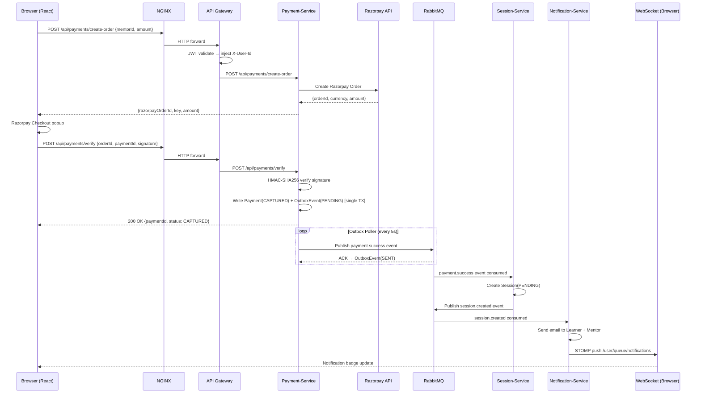
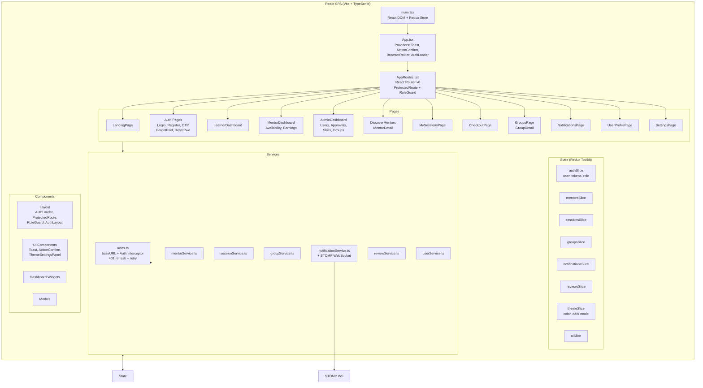
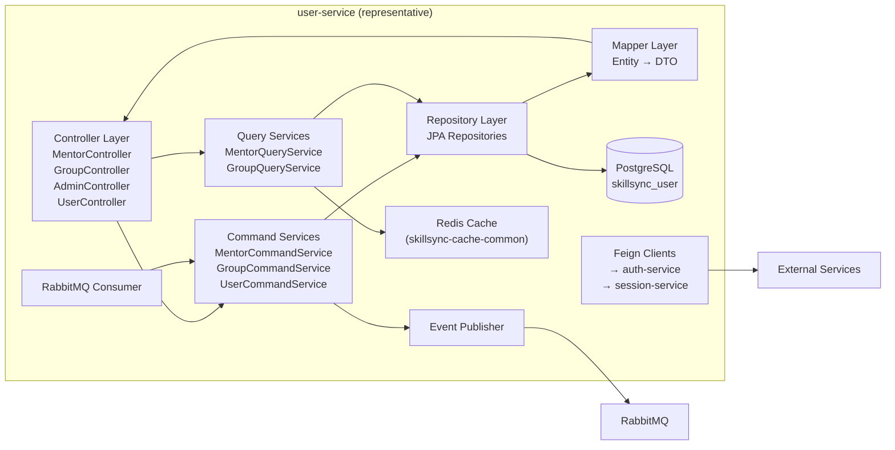
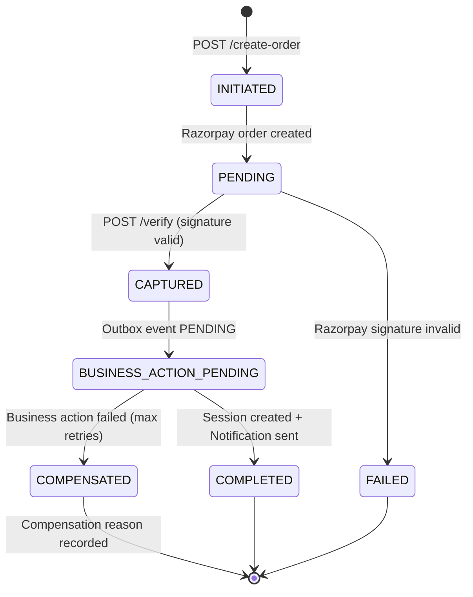

# SkillSync — Architecture Diagram

> **Document Type:** Architecture Diagram | **Version:** 1.0 | **Date:** 2026-05-10  
> **Architectural Style:** Event-Driven Microservices + CQRS + Saga + Transactional Outbox

---

## 1. Full System Architecture

```mermaid
graph TB
    %% ─── EXTERNAL ACTORS ───
    Browser(["🌐 Browser\n(Vercel SPA)"])
    Razorpay(["💳 Razorpay\nPayment API"])
    Gmail(["📧 Gmail SMTP\n:587"])
    GoogleOAuth(["🔑 Google OAuth 2.0"])

    %% ─── INGRESS ───
    NGINX["🔒 NGINX\nTLS Termination\nReverse Proxy\nEC2 :443/:80"]

    %% ─── DISCOVERY & CONFIG ───
    Eureka["📡 Eureka Server\n:8761\nService Registry"]
    ConfigServer["⚙️ Config Server\n:8888\nCentralized Config\n(Git-backed)"]

    %% ─── GATEWAY ───
    subgraph Gateway ["API Gateway :8080"]
        GW_JWT["JwtAuthenticationFilter\nValidate JWT → inject headers\n(X-User-Id, X-User-Role)"]
        GW_CSRF["CsrfOriginFilter\nOrigin Allowlist"]
        GW_RL["RateLimitingFilter\nRedis-backed"]
        GW_SH["SecurityHeadersFilter"]
        GW_RT["Route Table\n/api/auth/* → auth\n/api/mentors/* → user\n/api/groups/* → user\n/api/admin/* → user\n/api/sessions/* → session\n/api/reviews/* → session\n/api/payments/* → payment\n/api/notifications/* → notification\n/ws/* → notification (WS)"]
    end

    %% ─── MICROSERVICES ───
    subgraph AuthSvc ["auth-service :8081"]
        A_CTRL["AuthController\n/api/auth/*"]
        A_SVC["AuthService\nOtpService"]
        A_JWT["JwtTokenProvider"]
        A_DB[("skillsync_auth\nschema: auth\n• users\n• refresh_tokens\n• otp_tokens")]
    end

    subgraph UserSvc ["user-service :8082"]
        U_CTRL["UserController\nMentorController\nGroupController\nAdminController"]
        U_SVC["CQRS Services\nMentorCommand/Query\nGroupCommand/Query\nUserCommand/Query"]
        U_FEIGN["Feign Clients\n→ auth-service\n→ session-service"]
        U_DB[("skillsync_user\nschemas: users, mentors, groups\n• profiles\n• mentor_profiles\n• mentor_skills\n• availability_slots\n• user_skills\n• learning_groups\n• group_members\n• discussions")]
    end

    subgraph SkillSvc ["skill-service :8084"]
        SK_CTRL["SkillController\n/api/skills/*"]
        SK_SVC["SkillService"]
        SK_DB[("skillsync_skill\nschema: skills\n• skills\n• categories")]
    end

    subgraph SessionSvc ["session-service :8085"]
        SS_CTRL["SessionController\nReviewController"]
        SS_SVC["CQRS Services\nSessionCommand/Query\nReviewCommand/Query"]
        SS_CONSUMER["RabbitMQ Consumer\npayment.events"]
        SS_DB[("skillsync_session\nschemas: sessions, reviews\n• sessions\n• reviews")]
    end

    subgraph PaymentSvc ["payment-service :8086"]
        P_CTRL["PaymentController\nDlqReplayController"]
        P_SVC["PaymentService\nSagaOrchestrator"]
        P_OUTBOX["OutboxPublisher\n(polling scheduler)"]
        P_DB[("skillsync_payment\nschema: payments\n• payments\n• saga_state\n• outbox_events\n• failed_events")]
    end

    subgraph NotifSvc ["notification-service :8088"]
        N_CTRL["NotificationController\n/api/notifications/*"]
        N_SVC["NotificationService\nEmailService\nWebSocketService"]
        N_CONSUMER["RabbitMQ Consumer\nsession/payment/mentor events"]
        N_WS["STOMP WebSocket\n/ws/notifications\n→ /user/queue/notifications"]
        N_DB[("skillsync_notification\nschema: notifications\n• notifications")]
    end

    %% ─── INFRASTRUCTURE ───
    subgraph Infra ["Infrastructure"]
        Postgres[("🐘 PostgreSQL 16\n6 Databases")]
        RabbitMQ["🐇 RabbitMQ 3.13\nAMQP :5672\nMgmt :15672"]
        Redis["⚡ Redis 7.2\nCache + Rate-Limit\n:6379"]
        Zipkin["🔍 Zipkin\nDistributed Tracing\n:9411"]
    end

    %% ─── OBSERVABILITY ───
    subgraph Obs ["Observability"]
        Prometheus["📊 Prometheus\n:9090"]
        Grafana["📈 Grafana\n:3000"]
        Loki["📋 Loki\nLog Aggregation\n:3100"]
    end

    %% ─── CONNECTIONS ───

    Browser -->|"HTTPS / WSS"| NGINX
    NGINX -->|"HTTP :8080"| Gateway
    Browser -->|"Google ID Token"| GoogleOAuth
    GoogleOAuth -.->|"token validation"| Browser

    GW_JWT --> GW_CSRF --> GW_RL --> GW_SH --> GW_RT

    GW_RT -->|"auth routes"| AuthSvc
    GW_RT -->|"user/mentor/group/admin routes"| UserSvc
    GW_RT -->|"skill routes"| SkillSvc
    GW_RT -->|"session/review routes"| SessionSvc
    GW_RT -->|"payment routes"| PaymentSvc
    GW_RT -->|"notification routes"| NotifSvc
    GW_RT -.->|"WebSocket upgrade"| N_WS

    Gateway --> Eureka
    Gateway --> ConfigServer
    AuthSvc --> Eureka
    UserSvc --> Eureka
    SkillSvc --> Eureka
    SessionSvc --> Eureka
    PaymentSvc --> Eureka
    NotifSvc --> Eureka

    U_FEIGN -->|"Feign REST"| AuthSvc
    U_FEIGN -->|"Feign REST"| SessionSvc
    P_SVC -->|"Feign REST"| SessionSvc

    PaymentSvc -->|"HTTPS REST"| Razorpay
    NotifSvc -->|"SMTP TLS"| Gmail

    P_OUTBOX -->|"AMQP publish"| RabbitMQ
    SS_SVC -->|"AMQP publish"| RabbitMQ
    UserSvc -->|"AMQP publish"| RabbitMQ
    RabbitMQ -->|"consume"| SS_CONSUMER
    RabbitMQ -->|"consume"| N_CONSUMER

    AuthSvc --> A_DB --> Postgres
    UserSvc --> U_DB --> Postgres
    SkillSvc --> SK_DB --> Postgres
    SessionSvc --> SS_DB --> Postgres
    PaymentSvc --> P_DB --> Postgres
    NotifSvc --> N_DB --> Postgres

    GW_RL --> Redis
    UserSvc --> Redis
    SkillSvc --> Redis

    AuthSvc -.->|"traces"| Zipkin
    UserSvc -.->|"traces"| Zipkin
    SessionSvc -.->|"traces"| Zipkin
    PaymentSvc -.->|"traces"| Zipkin
    NotifSvc -.->|"traces"| Zipkin

    AuthSvc -.->|"metrics"| Prometheus
    UserSvc -.->|"metrics"| Prometheus
    SessionSvc -.->|"metrics"| Prometheus
    PaymentSvc -.->|"metrics"| Prometheus
    NotifSvc -.->|"metrics"| Prometheus

    Prometheus --> Grafana
    Loki --> Grafana

    N_WS -->|"STOMP push"| Browser
```

---

## 2. Request Flow Diagram (Happy-Path: Book Session)

---

## 3. Frontend Architecture

---

## 4. Microservice Internal Architecture (CQRS Pattern)

---

## 5. Payment Saga Architecture

---

## 6. API Gateway Routing Table

| Path Pattern | Target Service | Auth Required | Notes |
|---|---|---|---|
| `/api/auth/**` | auth-service | No (public) | login, register, OTP |
| `/api/mentors/search` | user-service | Yes | Learner / Mentor |
| `/api/mentors/**` | user-service | Yes | Role-scoped in service |
| `/api/groups/**` | user-service | Yes | Role-scoped in service |
| `/api/admin/**` | user-service | Yes (ADMIN) | Admin-only |
| `/api/users/**` | user-service | Yes | Own-profile only |
| `/api/skills/**` | skill-service | Yes (ADMIN for mutations) | |
| `/api/sessions/**` | session-service | Yes | Role-scoped in service |
| `/api/reviews/**` | session-service | Yes | |
| `/api/payments/**` | payment-service | Yes | |
| `/api/notifications/**` | notification-service | Yes | |
| `/ws/notifications` | notification-service | Yes | WebSocket upgrade |
| `/actuator/health/**` | gateway-self | No | Health probes |
