# SkillSync — Low-Level Design (LLD)

> **Document Type:** Low-Level Design | **Version:** 1.0 | **Date:** 2026-05-10

---

## 1. Auth-Service Module

### 1.1 Class Diagram

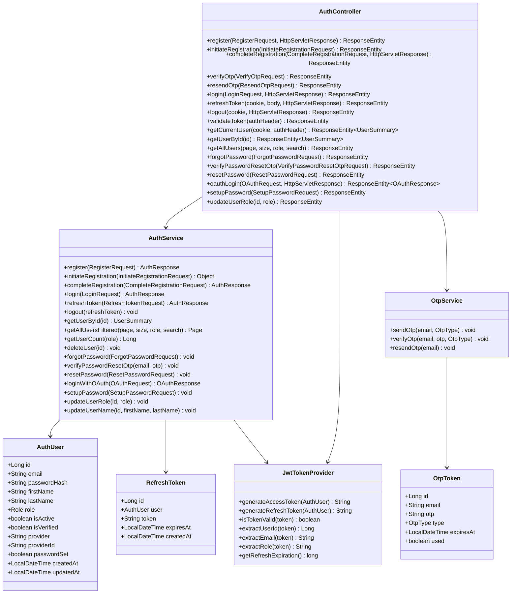

### 1.2 API Contracts

| Method | Path | Auth | Request Body | Response |
|---|---|---|---|---|
| POST | `/api/auth/register` | No | `{firstName, lastName, email, password, role}` | `AuthResponse` |
| POST | `/api/auth/initiate-registration` | No | `{firstName, lastName, email, password, role}` | `{message}` |
| POST | `/api/auth/complete-registration` | No | `{email, otp}` | `AuthResponse` |
| POST | `/api/auth/verify-otp` | No | `{email, otp}` | `{message}` |
| POST | `/api/auth/resend-otp` | No | `{email}` | `{message}` |
| POST | `/api/auth/login` | No | `{email, password}` | `AuthResponse` |
| POST | `/api/auth/refresh` | Cookie/Body | `{refreshToken?}` | `AuthResponse` |
| POST | `/api/auth/logout` | Cookie | — | 200 |
| GET | `/api/auth/validate` | Bearer | — | `"Token is valid"` |
| GET | `/api/auth/me` | Cookie/Bearer | — | `UserSummary` |
| POST | `/api/auth/forgot-password` | No | `{email}` | `{message}` |
| POST | `/api/auth/verify-password-reset-otp` | No | `{email, otp}` | `{message}` |
| POST | `/api/auth/reset-password` | No | `{email, otp, newPassword}` | `{message}` |
| POST | `/api/auth/oauth-login` | No | `{idToken, provider}` | `OAuthResponse` |
| POST | `/api/auth/setup-password` | Bearer/Cookie | `{password}` | `{message}` |
| PUT | `/api/auth/users/{id}/role` | ADMIN | `?role=ROLE_MENTOR` | 200 |
| GET | `/api/auth/internal/users` | Internal | `?page&size&role&search` | `Page<UserSummary>` |
| GET | `/api/auth/internal/users/{id}` | Internal | — | `UserSummary` |
| DELETE | `/api/auth/internal/users/{id}` | Internal | — | 200 |

### 1.3 AuthResponse Model
```json
{
  "accessToken": "eyJ...",
  "refreshToken": "eyJ...",
  "expiresIn": 86400,
  "user": {
    "id": 1,
    "email": "user@example.com",
    "firstName": "John",
    "lastName": "Doe",
    "role": "ROLE_LEARNER",
    "isVerified": true,
    "passwordSet": true
  }
}
```

### 1.4 Validation Rules
- `email`: Not blank, valid email format
- `password`: Min 8 characters (enforced via `@Valid`)
- `role`: Must be one of `ROLE_LEARNER | ROLE_MENTOR`
- OTP: 6-digit numeric, expires in 10 minutes, one-time use
- Refresh token: Expires in `JWT_REFRESH_EXPIRATION` ms (default 7 days)

### 1.5 Error Handling
| Scenario | HTTP Status | Message |
|---|---|---|
| Duplicate email | 409 | "Email already exists" |
| Invalid credentials | 401 | "Invalid credentials" |
| Expired/invalid OTP | 400 | "OTP expired or invalid" |
| Invalid/expired token | 401 | "Token invalid or expired" |
| User not found | 404 | "User not found" |
| Account not verified | 403 | "Email not verified" |

---

## 2. User-Service Module

### 2.1 Class Diagram (Key Classes)

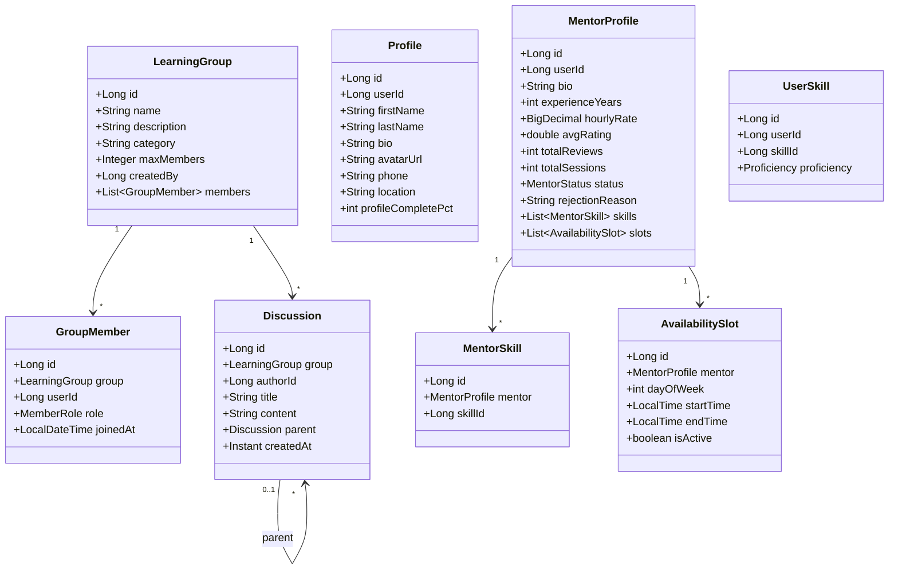

### 2.2 CQRS Pattern

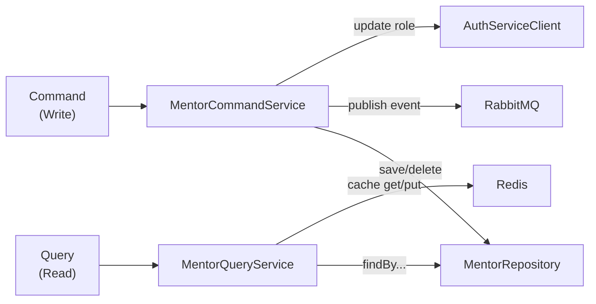

### 2.3 API Contracts

**Mentor Endpoints (`/api/mentors`)**

| Method | Path | Auth | Notes |
|---|---|---|---|
| GET | `/api/mentors/search` | Yes | `?skill, rating, minPrice, maxPrice, search` + Pageable |
| GET | `/api/mentors/{id}` | Yes | Mentor profile by mentor profile ID |
| GET | `/api/mentors/me` | Yes (MENTOR) | Own profile via X-User-Id |
| GET | `/api/mentors/pending` | Yes (ADMIN) | Pending applications |
| GET | `/api/mentors/me/availability` | Yes (MENTOR) | Own availability slots |
| POST | `/api/mentors/apply` | Yes (LEARNER) | `MentorApplicationRequest` |
| POST | `/api/mentors/me/availability` | Yes (MENTOR) | `AvailabilitySlotRequest` |
| DELETE | `/api/mentors/me/availability/{id}` | Yes (MENTOR) | Remove slot |
| PUT | `/api/mentors/{id}/approve` | Yes (ADMIN) | Approve mentor |
| PUT | `/api/mentors/{id}/reject` | Yes (ADMIN) | `?reason=...` |

**Group Endpoints (`/api/groups`)**

| Method | Path | Auth | Notes |
|---|---|---|---|
| GET | `/api/groups` | Yes | `?search, category` + Pageable |
| GET | `/api/groups/my` | Yes | Groups I belong to |
| GET | `/api/groups/{id}` | Yes | Single group detail |
| GET | `/api/groups/{id}/members` | Yes | Paginated members |
| GET | `/api/groups/{id}/discussions` | Yes | Threaded discussions |
| POST | `/api/groups` | Yes (MENTOR/ADMIN) | `CreateGroupRequest` |
| PUT | `/api/groups/{id}` | Yes | Own group update |
| DELETE | `/api/groups/{id}` | Yes | Owner/Admin only |
| POST | `/api/groups/{id}/join` | Yes | Join group |
| POST | `/api/groups/{id}/leave` | Yes | Leave group |
| POST | `/api/groups/{id}/members` | Yes | Add member by email |
| DELETE | `/api/groups/{id}/members/{userId}` | Yes | Remove member |
| POST | `/api/groups/{id}/discussions` | Yes | Post discussion |
| DELETE | `/api/groups/{id}/discussions/{discussionId}` | Yes | Delete discussion |

### 2.4 MentorApplicationRequest Model
```json
{
  "bio": "Expert in Java and Spring Boot...",
  "experienceYears": 5,
  "hourlyRate": 50.00,
  "skillIds": [1, 4, 5]
}
```

### 2.5 Validation Rules
- `bio`: Non-null, max 2000 chars
- `hourlyRate`: Positive, max 2 decimal places
- `experienceYears`: Non-negative integer
- `skillIds`: Non-empty list of valid skill IDs
- Group `name`: Non-blank, max 100 chars
- Group `maxMembers`: Positive integer (optional)
- Discussion `content`: Non-blank, max 5000 chars

---

## 3. Skill-Service Module

### 3.1 Class Diagram

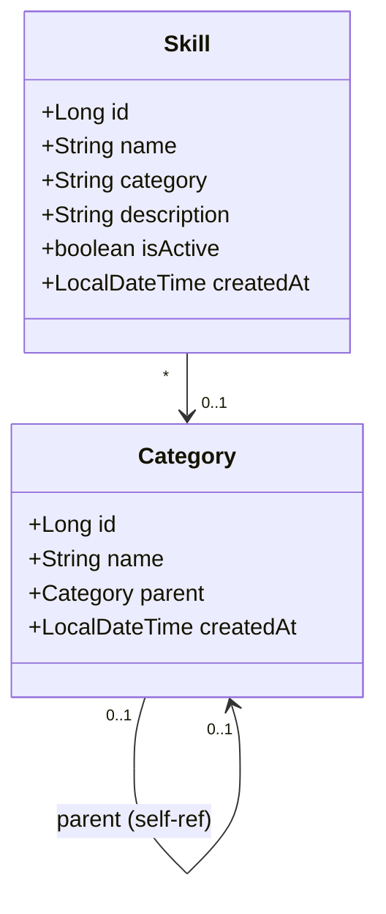

### 3.2 API Contracts

| Method | Path | Auth | Notes |
|---|---|---|---|
| GET | `/api/skills` | Yes | List all active skills |
| GET | `/api/skills/{id}` | Yes | Skill by ID |
| GET | `/api/skills/categories` | Yes | List categories |
| POST | `/api/skills` | ADMIN | Create skill |
| PUT | `/api/skills/{id}` | ADMIN | Update skill |
| DELETE | `/api/skills/{id}` | ADMIN | Deactivate skill |

---

## 4. Session-Service Module

### 4.1 Session State Machine

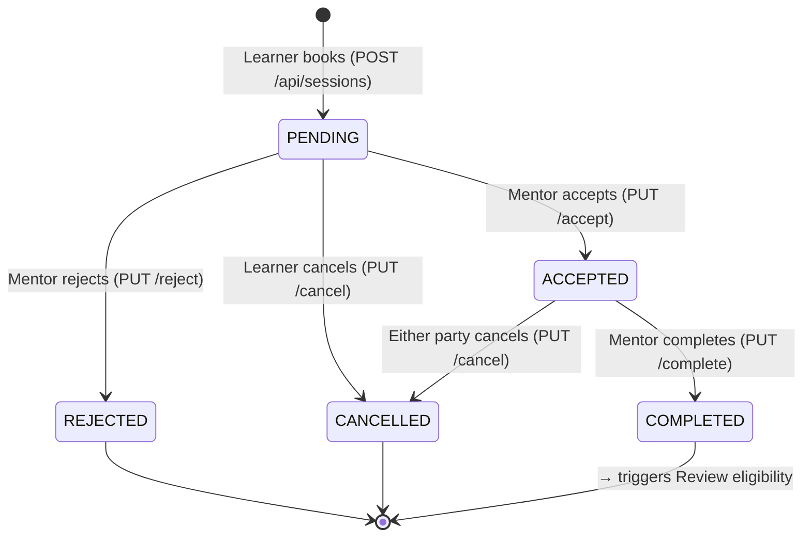

### 4.2 Class Diagram

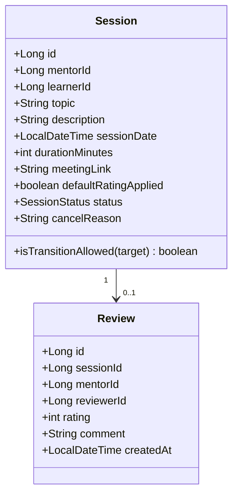

### 4.3 API Contracts

**Session Endpoints**

| Method | Path | Auth | Notes |
|---|---|---|---|
| GET | `/api/sessions/{id}` | Yes | Session by ID |
| GET | `/api/sessions/learner` | Yes | Learner's sessions `?status` + Pageable |
| GET | `/api/sessions/mentor` | Yes | Mentor's sessions `?status` + Pageable |
| GET | `/api/sessions/count` | Internal | Total session count |
| GET | `/api/sessions/mentor/{id}/metrics` | Yes | Mentor metrics |
| POST | `/api/sessions` | Yes | `CreateSessionRequest` |
| PUT | `/api/sessions/{id}/accept` | Yes (MENTOR) | Accept session |
| PUT | `/api/sessions/{id}/reject` | Yes (MENTOR) | `?reason=...` |
| PUT | `/api/sessions/{id}/cancel` | Yes | Cancel (own session) |
| PUT | `/api/sessions/{id}/complete` | Yes (MENTOR) | Mark complete |

**Review Endpoints**

| Method | Path | Auth | Notes |
|---|---|---|---|
| GET | `/api/reviews/mentor/{mentorId}` | Yes | Paginated reviews |
| GET | `/api/reviews/mentor/{mentorId}/summary` | Yes | Avg rating, count |
| GET | `/api/reviews/{id}` | Yes | Single review |
| GET | `/api/reviews/me` | Yes | My submitted reviews |
| POST | `/api/reviews` | Yes (LEARNER) | Submit review |
| DELETE | `/api/reviews/{id}` | Yes | Delete review |

### 4.4 CreateSessionRequest Model
```json
{
  "mentorId": 1,
  "topic": "Java Spring Boot Deep Dive",
  "description": "We'll cover microservices patterns...",
  "sessionDate": "2026-06-01T10:00:00",
  "durationMinutes": 60
}
```

### 4.5 Validation Rules
- `mentorId`: Must reference existing APPROVED mentor
- `topic`: Non-blank, max 200 chars
- `sessionDate`: Future date required
- `durationMinutes`: 30–180 range
- `rating` (Review): 1–5 integer
- One review per session (unique constraint on `session_id`)
- Session must be in `COMPLETED` status to accept a review

---

## 5. Payment-Service Module

### 5.1 Saga Flow

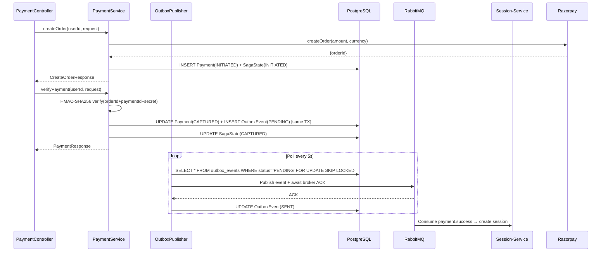

### 5.2 Class Diagram

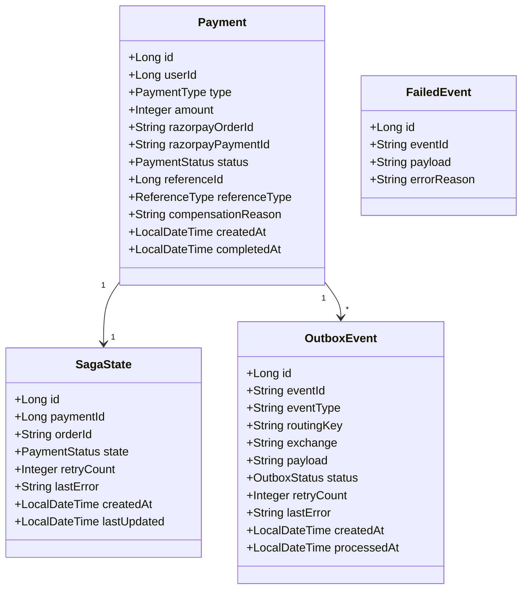

### 5.3 API Contracts

| Method | Path | Auth | Notes |
|---|---|---|---|
| POST | `/api/payments/create-order` | Yes | `CreateOrderRequest` |
| POST | `/api/payments/verify` | Yes | `VerifyPaymentRequest` |
| GET | `/api/payments/my-payments` | Yes | User's payment history |
| GET | `/api/payments/order/{orderId}` | Yes | Ownership validated |
| GET | `/api/payments/check` | Yes | `?type=MENTOR_REGISTRATION` |
| POST | `/api/dlq/replay` | ADMIN | Replay failed events |

### 5.4 CreateOrderRequest Model
```json
{
  "amount": 50000,
  "currency": "INR",
  "referenceId": 1,
  "referenceType": "SESSION_BOOKING",
  "type": "SESSION_BOOKING"
}
```

### 5.5 VerifyPaymentRequest Model
```json
{
  "razorpayOrderId": "order_abc123",
  "razorpayPaymentId": "pay_xyz789",
  "razorpaySignature": "hmac_signature_string"
}
```

---

## 6. Notification-Service Module

### 6.1 Notification Delivery Pipeline

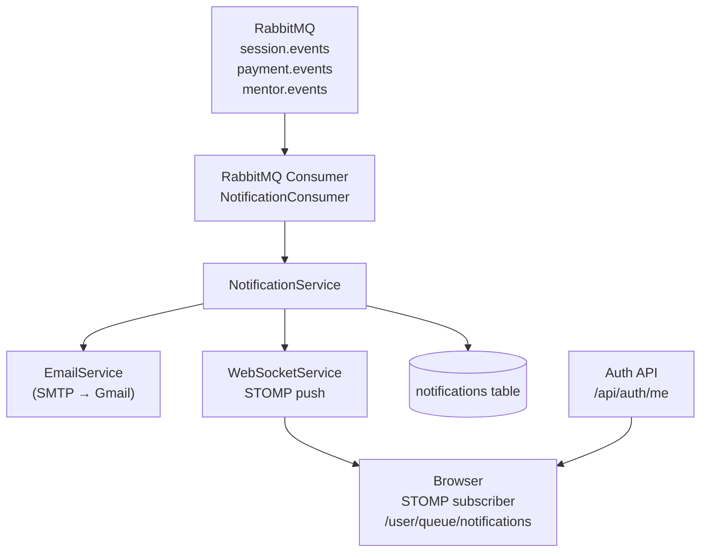

### 6.2 Notification Entity
```json
{
  "id": 42,
  "userId": 7,
  "type": "SESSION_ACCEPTED",
  "title": "Session Accepted",
  "message": "Your session with Mentor X on June 1st has been accepted.",
  "data": "{\"sessionId\": 15, \"mentorId\": 1}",
  "isRead": false,
  "createdAt": "2026-05-10T17:00:00Z"
}
```

### 6.3 API Contracts

| Method | Path | Auth | Notes |
|---|---|---|---|
| GET | `/api/notifications` | Yes | `?page&size` paginated |
| GET | `/api/notifications/unread/count` | Yes | `{count: 3}` |
| POST | `/api/notifications/read/{id}` | Yes | Mark single as read |
| PUT | `/api/notifications/{id}/read` | Yes | Alternative mark-read |
| PUT | `/api/notifications/read-all` | Yes | Mark all read |
| DELETE | `/api/notifications/{id}` | Yes | Delete notification |
| DELETE | `/api/notifications/all` | Yes | Clear all |

### 6.4 Event Types Consumed
| Event Type | Trigger |
|---|---|
| `session.created` | Learner books session |
| `session.accepted` | Mentor accepts |
| `session.rejected` | Mentor rejects |
| `session.cancelled` | Either party cancels |
| `session.completed` | Mentor marks complete |
| `payment.success` | Payment verified |
| `payment.failed` | Razorpay failure |
| `mentor.approved` | Admin approves application |
| `mentor.rejected` | Admin rejects application |
| `otp.registration` | Sent during registration |
| `otp.password-reset` | Sent for password reset |

---

## 7. Frontend Component Architecture

### 7.1 Authentication Flow

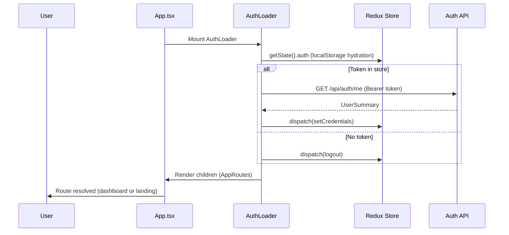

### 7.2 Redux State Shape

```typescript
interface RootState {
  auth: {
    user: UserSummary | null;
    accessToken: string | null;
    refreshToken: string | null;
    isAuthenticated: boolean;
    role: 'ROLE_LEARNER' | 'ROLE_MENTOR' | 'ROLE_ADMIN' | null;
  };
  mentors: {
    mentors: MentorData[];
    selectedMentor: MentorData | null;
    loading: boolean;
    error: string | null;
  };
  sessions: {
    sessions: SessionData[];
    loading: boolean;
    error: string | null;
  };
  groups: {
    groups: GroupData[];
    selectedGroup: GroupData | null;
    loading: boolean;
  };
  notifications: {
    notifications: NotificationData[];
    unreadCount: number;
    loading: boolean;
  };
  reviews: {
    reviews: ReviewData[];
    loading: boolean;
  };
  theme: {
    isDark: boolean;
    primaryColor: string;
    // ... theme tokens
  };
  ui: {
    sidebarOpen: boolean;
    // ... UI state
  };
}
```

### 7.3 Axios Interceptor Logic

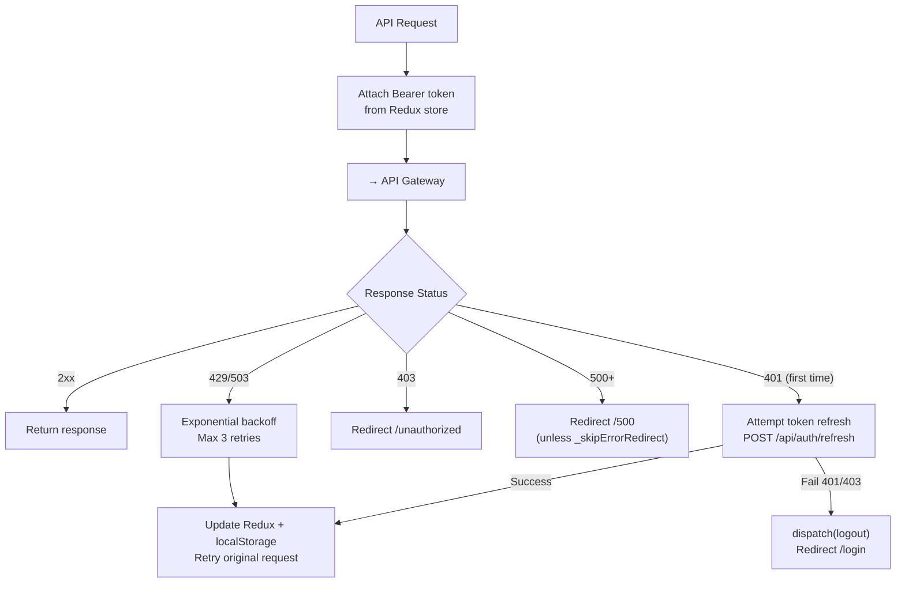

---

## 8. API Gateway Filter Chain

```
Incoming Request
    │
    ▼
CsrfOriginFilter           ← Check Origin header against ALLOWED_ORIGINS
    │
    ▼
JwtAuthenticationFilter    ← Validate JWT, inject X-User-Id/Email/Role headers
    │                         Skip: /api/auth/**, /actuator/health/**
    ▼
RateLimitingFilter         ← Redis: per-IP sliding window
    │
    ▼
SecurityHeadersFilter      ← Add X-Frame-Options, X-Content-Type-Options, etc.
    │
    ▼
Route to Microservice      ← Spring Cloud Gateway routing rules
```

---

## 9. Exception / Error Handling Flow

| Layer | Pattern | Example |
|---|---|---|
| Controller | `@RestControllerAdvice` global handler | Returns `{timestamp, status, error, message}` |
| Service | Custom domain exceptions | `MentorNotFoundException`, `SessionTransitionException` |
| Feign | Feign error decoder | Maps 404 to `ResourceNotFoundException` |
| RabbitMQ | Dead Letter Queue | Failed messages → `DLQ` → `FailedEvent` table |
| Payment | Saga compensation | On saga failure → `Payment(COMPENSATED)` + `compensationReason` |
| Frontend | Axios interceptor | Global 401/403/500 handling + per-request `_skip` flags |
| Gateway | Spring error handling | Propagates service errors to client unchanged |
