# SkillSync — Database Design / ER Diagram

> **Document Type:** Database Design | **Version:** 1.0 | **Date:** 2026-05-10

---

## 1. Database & Schema Overview

| Database | Schema(s) | Owning Service | Tables |
|---|---|---|---|
| `skillsync_auth` | `auth` | auth-service | users, refresh_tokens, otp_tokens |
| `skillsync_user` | `users`, `mentors`, `groups` | user-service | profiles, user_skills, mentor_profiles, mentor_skills, availability_slots, learning_groups, group_members, discussions |
| `skillsync_skill` | `skills` | skill-service | skills, categories |
| `skillsync_session` | `sessions`, `reviews` | session-service | sessions, reviews |
| `skillsync_notification` | `notifications` | notification-service | notifications |
| `skillsync_payment` | `payments` | payment-service | payments, saga_state, outbox_events, failed_events |

**Total: 6 databases · 10 schemas · 18 tables**

---

## 2. Complete ER Diagram

```mermaid
erDiagram

    %% ── AUTH DATABASE ──
    AUTH_USERS {
        bigserial id PK
        varchar email UK "NOT NULL"
        varchar password_hash "NOT NULL"
        varchar first_name "NOT NULL"
        varchar last_name "NOT NULL"
        varchar role "NOT NULL ENUM: ROLE_LEARNER,ROLE_MENTOR,ROLE_ADMIN"
        boolean is_active "NOT NULL DEFAULT true"
        boolean is_verified "NOT NULL DEFAULT false"
        varchar provider "nullable: google"
        varchar provider_id "nullable"
        boolean password_set "NOT NULL DEFAULT true"
        timestamp created_at "NOT NULL"
        timestamp updated_at
    }

    REFRESH_TOKENS {
        bigserial id PK
        bigint user_id FK "NOT NULL → auth.users"
        varchar token UK "NOT NULL"
        timestamp expires_at "NOT NULL"
        timestamp created_at "NOT NULL"
    }

    OTP_TOKENS {
        bigserial id PK
        varchar email "NOT NULL"
        varchar otp "NOT NULL"
        varchar type "ENUM: REGISTRATION,PASSWORD_RESET"
        timestamp expires_at "NOT NULL"
        boolean used "DEFAULT false"
    }

    %% ── USER DATABASE ──
    PROFILES {
        bigserial id PK
        bigint user_id UK "NOT NULL (ref: auth.users.id)"
        varchar first_name
        varchar last_name
        varchar bio "max 1000"
        varchar avatar_url
        varchar phone
        varchar location
        int profile_complete_pct "DEFAULT 0"
        timestamp created_at
        timestamp updated_at
    }

    USER_SKILLS {
        bigserial id PK
        bigint user_id "NOT NULL (ref: auth.users.id)"
        bigint skill_id "NOT NULL (ref: skills.skills.id)"
        varchar proficiency "ENUM: BEGINNER,INTERMEDIATE,ADVANCED"
    }

    MENTOR_PROFILES {
        bigserial id PK
        bigint user_id UK "NOT NULL (ref: auth.users.id)"
        text bio "max 2000"
        int experience_years
        decimal hourly_rate "precision 10,2"
        double avg_rating "DEFAULT 0.0"
        int total_reviews "DEFAULT 0"
        int total_sessions "DEFAULT 0"
        varchar status "ENUM: PENDING,APPROVED,REJECTED"
        varchar rejection_reason "max 1000"
        timestamp created_at
        timestamp updated_at
    }

    MENTOR_SKILLS {
        bigserial id PK
        bigint mentor_id FK "NOT NULL → mentor_profiles"
        bigint skill_id "NOT NULL (ref: skills.skills.id)"
    }

    AVAILABILITY_SLOTS {
        bigserial id PK
        bigint mentor_id FK "NOT NULL → mentor_profiles"
        int day_of_week "0=Sunday..6=Saturday"
        time start_time
        time end_time
        boolean is_active "DEFAULT true"
    }

    LEARNING_GROUPS {
        bigserial id PK
        varchar name "NOT NULL"
        text description "max 2000"
        varchar category "max 100"
        int max_members
        bigint created_by "NOT NULL (ref: auth.users.id)"
        timestamp created_at
        timestamp updated_at
    }

    GROUP_MEMBERS {
        bigserial id PK
        bigint group_id FK "NOT NULL → learning_groups"
        bigint user_id "NOT NULL (ref: auth.users.id)"
        varchar role "ENUM: OWNER,ADMIN,MEMBER"
        timestamp joined_at
    }

    DISCUSSIONS {
        bigserial id PK
        bigint group_id FK "NOT NULL → learning_groups"
        bigint author_id "NOT NULL (ref: auth.users.id)"
        varchar title "max 150"
        text content "NOT NULL max 5000"
        bigint parent_id FK "nullable → discussions (self-ref)"
        timestamptz created_at "NOT NULL"
    }

    %% ── SKILL DATABASE ──
    CATEGORIES {
        bigserial id PK
        varchar name UK "NOT NULL"
        bigint parent_id FK "nullable → categories (self-ref)"
        timestamp created_at
    }

    SKILLS {
        bigserial id PK
        varchar name UK "NOT NULL"
        varchar category
        varchar description
        boolean is_active "DEFAULT true"
        timestamp created_at
    }

    %% ── SESSION DATABASE ──
    SESSIONS {
        bigserial id PK
        bigint mentor_id "NOT NULL (ref: mentor_profiles.id)"
        bigint learner_id "NOT NULL (ref: auth.users.id)"
        varchar topic "NOT NULL"
        text description "max 2000"
        timestamp session_date "NOT NULL"
        int duration_minutes
        varchar meeting_link
        boolean default_rating_applied "NOT NULL DEFAULT false"
        varchar status "NOT NULL ENUM: PENDING,ACCEPTED,REJECTED,CANCELLED,COMPLETED"
        varchar cancel_reason
        timestamp created_at
        timestamp updated_at
    }

    REVIEWS {
        bigserial id PK
        bigint session_id UK "NOT NULL → sessions"
        bigint mentor_id "NOT NULL (ref: mentor_profiles.id)"
        bigint reviewer_id "NOT NULL (ref: auth.users.id)"
        int rating "1-5"
        text comment "max 2000"
        timestamp created_at
        timestamp updated_at
    }

    %% ── NOTIFICATION DATABASE ──
    NOTIFICATIONS {
        bigserial id PK
        bigint user_id "NOT NULL (ref: auth.users.id)"
        varchar type "NOT NULL"
        varchar title "NOT NULL"
        text message "max 2000"
        text data "JSON payload"
        boolean is_read "NOT NULL DEFAULT false"
        timestamptz created_at "NOT NULL"
    }

    %% ── PAYMENT DATABASE ──
    PAYMENTS {
        bigserial id PK
        bigint user_id "NOT NULL (ref: auth.users.id)"
        varchar type "NOT NULL ENUM: SESSION_BOOKING,MENTOR_REGISTRATION"
        int amount "in paise"
        varchar razorpay_order_id UK "NOT NULL max 64"
        varchar razorpay_payment_id "max 64"
        varchar status "NOT NULL ENUM: INITIATED,PENDING,CAPTURED,FAILED,COMPENSATED"
        bigint reference_id "NOT NULL"
        varchar reference_type "NOT NULL ENUM: SESSION_BOOKING,MENTOR_REGISTRATION"
        varchar compensation_reason "max 500"
        timestamp created_at
        timestamp completed_at
    }

    SAGA_STATE {
        bigserial id PK
        bigint payment_id UK "NOT NULL → payments"
        varchar order_id "NOT NULL max 64"
        varchar state "NOT NULL ENUM mirrors PaymentStatus"
        int retry_count "DEFAULT 0"
        varchar last_error "max 1000"
        timestamp created_at
        timestamp last_updated
    }

    OUTBOX_EVENTS {
        bigserial id PK
        varchar event_id UK "NOT NULL max 64"
        varchar event_type "NOT NULL max 100"
        varchar routing_key "NOT NULL max 100"
        varchar exchange "NOT NULL max 100"
        text payload "NOT NULL JSON"
        varchar status "ENUM: PENDING,PROCESSING,SENT,FAILED"
        int retry_count "DEFAULT 0"
        varchar last_error "max 500"
        timestamp created_at
        timestamp processed_at
        timestamp last_attempt_at
    }

    FAILED_EVENTS {
        bigserial id PK
        varchar event_id "NOT NULL"
        text payload
        varchar error_reason
        timestamp created_at
    }

    %% ── RELATIONSHIPS ──
    AUTH_USERS ||--o{ REFRESH_TOKENS : "has"
    AUTH_USERS ||--o{ OTP_TOKENS : "requests"
    AUTH_USERS ||--|| PROFILES : "has profile"
    AUTH_USERS ||--o{ USER_SKILLS : "has skills"
    AUTH_USERS ||--o| MENTOR_PROFILES : "may be mentor"
    MENTOR_PROFILES ||--o{ MENTOR_SKILLS : "teaches"
    MENTOR_PROFILES ||--o{ AVAILABILITY_SLOTS : "offers"
    AUTH_USERS ||--o{ LEARNING_GROUPS : "creates"
    LEARNING_GROUPS ||--o{ GROUP_MEMBERS : "has"
    LEARNING_GROUPS ||--o{ DISCUSSIONS : "contains"
    DISCUSSIONS ||--o{ DISCUSSIONS : "replies to"
    CATEGORIES ||--o{ CATEGORIES : "parent"
    SESSIONS ||--o| REVIEWS : "has review"
    PAYMENTS ||--|| SAGA_STATE : "has saga"
    PAYMENTS ||--o{ OUTBOX_EVENTS : "generates"
```

---

## 3. Entity Attribute Details

### 3.1 `auth.users`
| Column | Type | Constraints | Notes |
|---|---|---|---|
| `id` | BIGSERIAL | PK | Auto-increment |
| `email` | VARCHAR | UNIQUE, NOT NULL | Used as login identifier |
| `password_hash` | VARCHAR | NOT NULL | BCrypt $2b$10$ |
| `first_name` | VARCHAR | NOT NULL | |
| `last_name` | VARCHAR | NOT NULL | |
| `role` | VARCHAR | NOT NULL | `ROLE_LEARNER | ROLE_MENTOR | ROLE_ADMIN` |
| `is_active` | BOOLEAN | NOT NULL | Soft-disable account |
| `is_verified` | BOOLEAN | NOT NULL | Email OTP verified |
| `provider` | VARCHAR | nullable | `google` for OAuth |
| `provider_id` | VARCHAR | nullable | Google sub claim |
| `password_set` | BOOLEAN | NOT NULL DEFAULT true | false for OAuth-only users |
| `created_at` | TIMESTAMP | NOT NULL | Auditing |
| `updated_at` | TIMESTAMP | | Auditing |

### 3.2 `mentors.mentor_profiles`
| Column | Type | Constraints | Notes |
|---|---|---|---|
| `user_id` | BIGINT | UNIQUE, NOT NULL | Cross-DB ref to auth.users |
| `status` | VARCHAR | NOT NULL | `PENDING | APPROVED | REJECTED` |
| `hourly_rate` | DECIMAL(10,2) | | INR per session |
| `avg_rating` | DOUBLE | DEFAULT 0.0 | Denormalized for performance |
| `total_reviews` | INT | DEFAULT 0 | Denormalized counter |
| `total_sessions` | INT | DEFAULT 0 | Denormalized counter |

### 3.3 `payments.payments`
| Column | Type | Constraints | Notes |
|---|---|---|---|
| `amount` | INT | NOT NULL | In **paise** (₹1 = 100 paise) |
| `razorpay_order_id` | VARCHAR(64) | UNIQUE, NOT NULL | Idempotency key |
| `reference_id` | BIGINT | NOT NULL | Points to session / mentor profile |
| `reference_type` | VARCHAR | NOT NULL | `SESSION_BOOKING | MENTOR_REGISTRATION` |

---

## 4. Indexes

| Table | Index Name | Columns | Type |
|---|---|---|---|
| `payments` | `idx_payment_user_id` | `user_id` | B-Tree |
| `payments` | `idx_payment_status` | `status` | B-Tree |
| `payments` | `idx_payment_reference` | `reference_id, reference_type` | Composite |
| `payments` | `idx_payment_user_type_status` | `user_id, type, status` | Composite |
| `outbox_events` | `idx_outbox_status` | `status` | B-Tree |
| `outbox_events` | `idx_outbox_created` | `created_at` | B-Tree |
| `outbox_events` | `idx_outbox_status_retry` | `status, retry_count` | Composite |
| `saga_state` | `idx_saga_payment_id` | `payment_id` | Unique |
| `saga_state` | `idx_saga_state` | `state` | B-Tree |
| `group_members` | `idx_group_members_user_id` | `user_id` | B-Tree |
| `discussions` | `idx_discussions_group_created_at` | `group_id, created_at` | Composite |
| `discussions` | `idx_discussions_parent_id` | `parent_id` | B-Tree |

---

## 5. Key Relationships Summary

| Relationship | Type | Notes |
|---|---|---|
| `auth.users` → `mentor_profiles` | 1:0..1 | A user can have at most one mentor profile |
| `auth.users` → `profiles` | 1:1 | Every user has exactly one profile |
| `auth.users` → `refresh_tokens` | 1:M | Multiple active sessions |
| `mentor_profiles` → `mentor_skills` | 1:M | A mentor teaches many skills |
| `mentor_profiles` → `availability_slots` | 1:M | Weekly availability schedule |
| `learning_groups` → `group_members` | 1:M | Group membership |
| `learning_groups` → `discussions` | 1:M | Threaded posts |
| `discussions` → `discussions` | 1:M (self) | Thread replies |
| `categories` → `categories` | 1:M (self) | Hierarchical categories |
| `sessions` → `reviews` | 1:0..1 | One review per completed session |
| `payments` → `saga_state` | 1:1 | Saga tracking per payment |
| `payments` → `outbox_events` | 1:M | Events published per payment |

---

## 6. Cross-Service Reference Strategy

Since each microservice has its own database, foreign keys across databases are **not enforced at the DB level**. References are maintained by convention:

| Field | In Table | References | Enforced By |
|---|---|---|---|
| `user_id` | `profiles` | `auth.users.id` | Application logic |
| `user_id` | `mentor_profiles` | `auth.users.id` | Application logic |
| `mentor_id` | `sessions` | `mentor_profiles.id` | Application + Feign client |
| `learner_id` | `sessions` | `auth.users.id` | Application logic |
| `skill_id` | `mentor_skills` | `skills.skills.id` | Application logic |
| `skill_id` | `user_skills` | `skills.skills.id` | Application logic |
| `user_id` | `notifications` | `auth.users.id` | Application logic |
| `user_id` | `payments` | `auth.users.id` | Application logic (JWT header) |

---

## 7. Seed Data Summary

The `insert-data.sql` seeds the following initial state for development/demo:

| Entity | Count | Notes |
|---|---|---|
| Users | 6 | 1 Admin, 2 Learners, 3 Mentors |
| Mentor Profiles | 3 | All status=APPROVED |
| Skills | 5 | Java, Kotlin, AI/ML, Communication, Full Stack |
| Mentor-Skill Assignments | 7 | Distributed across 3 mentors |
