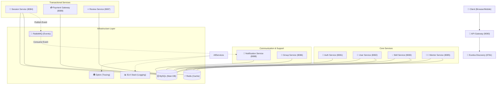
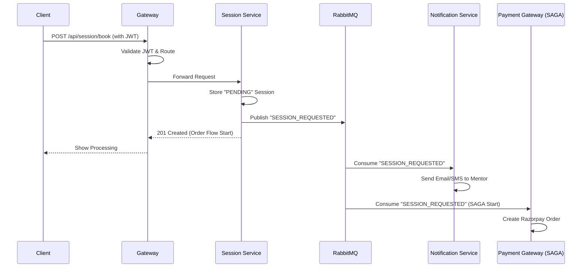
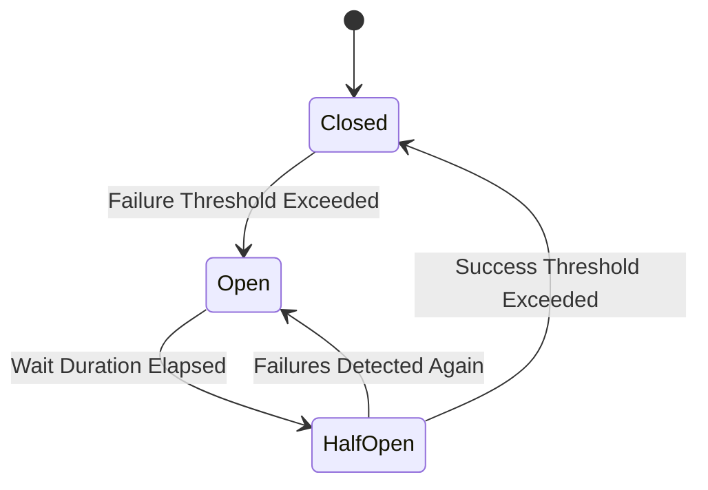
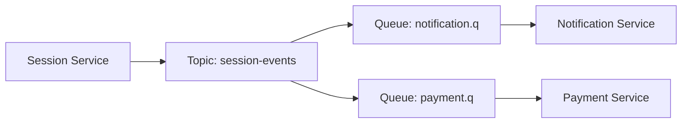
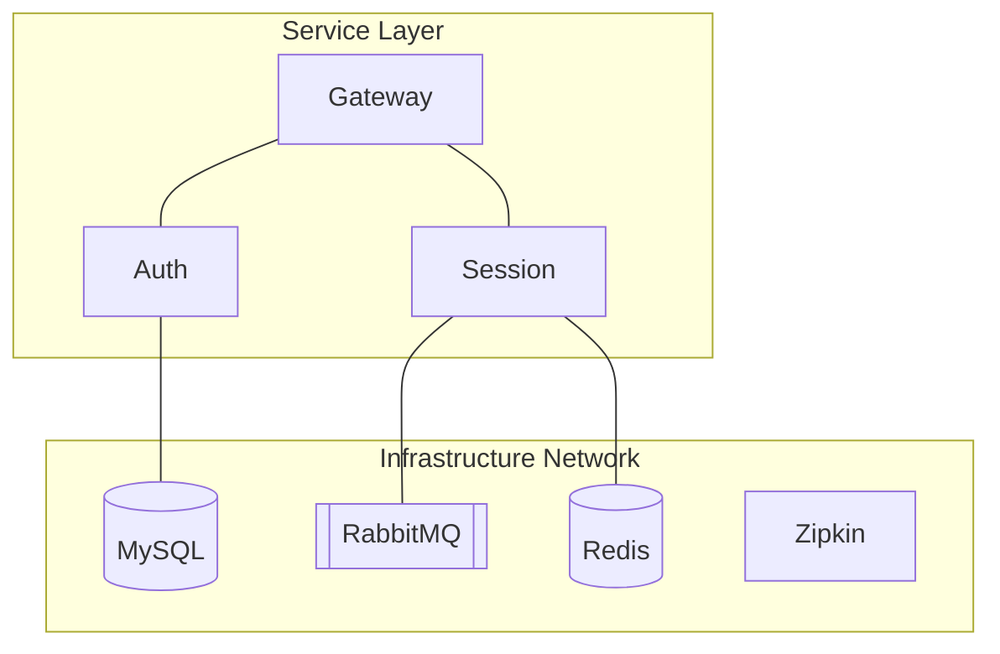
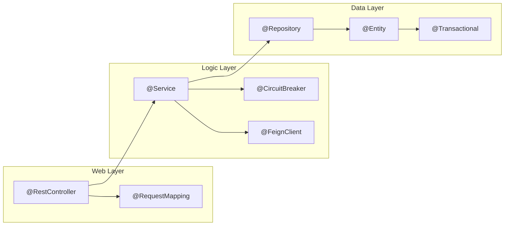

# 📘 SkillSync: Professional Project Documentation

> [!NOTE]
> This documentation provides a deep, structured analysis of the SkillSync microservices ecosystem, focusing on architecture, design patterns, and enterprise-grade distributed system concepts.

---

## 1️⃣ Project Overview  

### What is SkillSync?  
**SkillSync** is an enterprise-level, high-availability microservices platform designed to bridge the gap between learners and mentors. It allows users to browse expertise, book mentorship sessions, manage skill-based learning groups, and handle secure payments in a distributed environment.

### Problem it Solves  
In traditional monolithic tutoring platforms, scaling specific features (like payment or notifications) independently is difficult, and a single failure can crash the entire system. SkillSync solves this by decoupling logic into 11+ independent services, ensuring **high availability (HA)** and **resilience**.

### Goal of the Project  
To provide a scalable, observable, and resilient environment for mentorship where every interaction is traced, every failure is handled gracefully, and every transaction is eventually consistent.

### Real-World Analogy  
**SkillSync is like a Modern Smart Airport.**  
- **API Gateway**: The Security Checkpoint (only authorized people pass).  
- **Eureka**: The Flight Information Board (telling everyone where flights/services are).  
- **RabbitMQ**: The Luggage Conveyor Belt (moving messages behind the scenes).  
- **Services**: The specialized shops, lounges, and gates (each doing one thing).  

---

## 2️⃣ HIGH-LEVEL ARCHITECTURE  

### Architecture Type: Microservices (Distributed System)  

SkillSync follows a **Network-Centric Architecture** where services are partitioned by domain (DDD - Domain Driven Design).  

---

## 3️⃣ COMPLETE REQUEST FLOW  

### End-to-End Flow: Booking a Session  

---

## 4️⃣ FOLDER & FILE ANALYSIS (VERY DEEP)

| File/Folder | Purpose | Why Used | Internal Working | Impact if Removed |
| :--- | :--- | :--- | :--- | :--- |
| `api-gateway/` | Central Entry Point | Security & Routing | Acts as a reverse proxy using Spring Cloud Gateway | No external access possible |
| `eureka-server/` | Service Registry | Service Discovery | Services register their IP/Port here | Inter-service calls will fail |
| `application.properties` | Config Management | Environment Settings | Spring Boot picks these for DB, Cloud, and custom props | App won't start/connect to DB |
| `JwtAuthenticationFilter` | Security Layer | Stateless Auth | Extracts JWT from header, validates with Secret, sets SecurityContext | Authorization becomes impossible |
| `SagaOrchestrator` | Transaction Mgr | Consistency | Manages Step 1..Step N of a multi-service txn | Payments/Sessions stay out of sync |
| `pom.xml` | Build Definition | Dependency Management | Maven downloads and links libraries | Project cannot be built |
| `docker-compose.yml` | Infrastructure | Orchestration | Launches MySQL, Redis, RabbitMQ in containers | Developer setup takes hours |
| `GlobalExceptionHandler` | Error Standard | Consistency | `@RestControllerAdvice` catches all throwables | Raw stack traces shown to users |
| `zipkin/` | Distributed Tracing | Observability | Collects SPAN IDs to visualize request paths | Impossible to debug slow requests |
| `logstash.conf` | Log Routing | ELK Pipeline | Routes app logs to Elasticsearch | Log visualization in Kibana fails |

---

## 5️⃣ AUTO-DETECTED CONCEPTS (CRITICAL SECTION)

The project leverages **Spring Cloud 2024.x** and **Java 17/21**. The following concepts are implemented:

- **API Gateway**: Spring Cloud Gateway (Non-blocking, reactive).
- **Service Discovery**: Netflix Eureka.
- **Authentication**: JWT (jjwt) for stateless identity management.
- **Database**: JPA/Hibernate with MySQL partitioned by domain.
- **Messaging**: RabbitMQ (Topic Exchange) with JSON Message Converters.
- **Caching**: Redis (using `@Cacheable` and direct `RedisTemplate`).
- **Resilience**: Resilience4j (Circuit Breakers on Feign Clients).
- **Observability**: Zipkin (Micrometer Brave) for Spans/Traces.
- **SAGA Pattern**: Orchestration-based transactions in `payment-gateway`.
- **Infrastructure**: Docker & Docker Compose for multi-container deployment.
- **Security**: Spring Security 6.x (Internal filters + Gateway validation).
- **API Documentation**: SpringDoc (OpenAPI 3) with Gateway aggregation.
- **Build Tool**: Maven with Lombok annotation processing.
- **SLA/Monitoring**: SLF4J + Logstash for central logging.

---

## 6️⃣ FOR EACH CONCEPT (DETAILED EXPLANATION)

| Concept | What | Why | Where Used | Internal Working |
| :--- | :--- | :--- | :--- | :--- |
| **Circuit Breaker** | Protection trip | Prevents cascading failures | Inter-service Feign calls | If Service A fails 50% of time, "trip" the circuit |
| **JWT** | Signed Token | Security without Session storage | `auth-service` & `gateway` | JSON payload signed with HMAC-SHA256 |
| **RabbitMQ** | Message Broker | Async decoupled communication | `session` & `notification` | Publisher -> Exchange -> Queue -> Consumer |
| **SAGA** | Dist. Transaction | Atomic operations across services | `payment-gateway` | Steps with compensation (Refund) logic |
| **Redis** | In-memory cache | Reduce DB load | `user-service` profiles | Key-Value storage with TTL (Time To Live) |

---

## 7️⃣ CONCEPT FLOW DIAGRAMS  

### ⚡ Circuit Breaker State Machine

### 🐇 RabbitMQ Message Flow

---

## 8️⃣ TECHNOLOGY DECISION ANALYSIS  

| Technology Used | Alternatives | Why Chosen | When to Use | When NOT to Use |
| :--- | :--- | :--- | :--- | :--- |
| **RabbitMQ** | Kafka | Less complex, better for simple task routing | Small-medium scale event flows | Extremely high-throughput analytics |
| **MySQL** | PostgreSQL | Standard for JPA, easy scaling for SkillSync | High-consistency structured data | Unstructured big data (Use NoSQL) |
| **Zipkin** | Jaeger | Seamless integration with Micrometer Tracing | Distributed environments (Microservices) | Simple Monoliths |
| **Redis** | Memcached | Supports Data Structures (Hashes, Lists) | Latency-sensitive high-read data | Cold storage |

---

## 9️⃣ DATA FLOW (REAL SCENARIO: Payment Verification)

1.  **Learner** pays on Razorpay (Frontend).
2.  **Razorpay** returns `razorpay_payment_id`.
3.  **Client** calls `POST /api/payment/verify` (through Gateway).
4.  **SagaOrchestrator** transitions from `PAYMENT_PENDING` to `PROCESSING`.
5.  **PaymentProcessor** verifies signature using Razorpay Secret.
6.  **SagaOrchestrator** calls `SessionServiceClient` (Feign) to update status to `CONFIRMED`.
7.  **If verification fails**, Saga triggers **Compensation**: Session marked as `PAYMENT_FAILED`.

---

## 🔟 ERROR HANDLING & RESILIENCE  

### Flow: Circuit Breaker + Retry
1.  **Request** initiated (Feign Client).
2.  **Circuit Breaker** checks status (Closed/Open).
3.  **If failed**, **Retry** attempts 3 times (500ms delay).
4.  **If still failed**, **Fallback** method (local logic) is executed.
5.  **GlobalExceptionHandler** wraps the result in a clean `ApiResponse` JSON.

---

## 1️⃣1️⃣ SECURITY FLOW  

### Flowchart: Authentication & Authorization
1.  **Client** submits credentials to `/api/auth/login`.
2.  **Auth Service** verifies, generates **JWT**, returns to Client.
3.  **Client** submits next request with `Authorization: Bearer <TOKEN>`.
4.  **Gateway** parses JWT, extracts `User-ID`, injects into custom header.
5.  **Target Service** verifies `X-Internal-Secret` and extracts user context.

---

## 1️⃣2️⃣ DEPLOYMENT & INFRASTRUCTURE  

### Diagram: Docker Container Topology

---

## 1️⃣3️⃣ REAL-WORLD USE CASES  

| Concept | Industry Usage | Example |
| :--- | :--- | :--- |
| **Circuit Breaker** | E-commerce | Netflix used Hystrix to prevent "Recommended" service from crashing the app |
| **RabbitMQ** | Logistics | Amazon uses messaging to update order status across shipping centers |
| **JWT** | SaaS | Google/GitHub use tokens for mobile app authentication |
| **Resilience4j** | Fintech | Banks use Retries for unreliable payment gateway connections |

---

## 1️⃣4️⃣ INTERVIEW PREPARATION  

### Concept-Based Questions
- **Q**: Why use Spring Cloud Gateway instead of Zuul?  
- **A**: Gateway is built on WebFlux (non-blocking), offering better performance than Zuul (blocking).

### Scenario-Based Questions
- **Q**: How do you prevent a "Slow Service" from bringing down the entire system?  
- **A**: Implementing a **Circuit Breaker** with a timeout ensures the caller stops waiting for the slow service.

### Architecture Questions
- **Q**: What is the difference between Orchestration and Choreography in Sagas?  
- **A**: Orchestration (used in SkillSync) uses a central "Manager", while Choreography uses decentralized events.

---

## 1️⃣5️⃣ FINAL SUMMARY  

**SkillSync** is a modern, distributed mentorship platform. It uses **Gateways** for entry, **Discovery** for lookup, and **Events** for communication. It is designed with a **Resilient Heart** (Resilience4j) and an **Observable Mind** (Zipkin/ELK), ensuring that even in a complex multi-service world, your mentorship session is booked, paid for, and notified reliably.

---

## 1️⃣6️⃣ DEEP ANNOTATION ANALYSIS (SPRING & ENTERPRISE)

> [!NOTE]
> Annotations in SkillSync are the declarative engine that powers dependency injection, persistence, security, and distributed resilience.

### 🟢 CORE SPRING & DEPENDENCY INJECTION
| Annotation | Purpose | Why Used | Internal Working | Impact if Removed |
| :--- | :--- | :--- | :--- | :--- |
| `@SpringBootApplication` | Bootstrap | To start the Spring Context | Combines `@Configuration`, `@EnableAutoConfiguration`, and `@ComponentScan` | App won't start; no beans will be loaded |
| `@Service` / `@Repository` | Component Identification | To mark specialized beans | Specializations of `@Component` for persistence/logic separation | Components won't be scanned; Autowiring fails |
| `@Autowired` | Dependency Injection | To inject required beans | Reflection-based lookup in the ApplicationContext | `NullPointerException` on every service call |
| `@Value("${prop}")` | Configuration | To inject external properties | Reads from `application.properties` or env variables | Hardcoded values only; no dynamic config |

### 🌐 REST API & WEB LAYER
| Annotation | Purpose | Why Used | Internal Working | Impact if Removed |
| :--- | :--- | :--- | :--- | :--- |
| `@RestController` | API Entry Point | To handle HTTP requests | Combines `@Controller` and `@ResponseBody` (JSON conversion) | Class becomes standard POJO; endpoints unreachable |
| `@GetMapping` / `@PostMapping` | Route Mapping | To define HTTP verbs | Registers method in `HandlerMapping` | 404 Not Found for all API calls |
| `@RequestBody` | Payload Binding | To map JSON to Java objects | Uses `HttpMessageConverter` (Jackson) to deserialize | Input data is lost; request body is null |
| `@RestControllerAdvice` | Global Monitoring | To handle errors globally | Intercepts exceptions across all Controllers | Raw stack traces shown; inconsistent error JSON |

### 🗄️ PERSISTENCE (SPRING DATA JPA)
| Annotation | Purpose | Why Used | Internal Working | Impact if Removed |
| :--- | :--- | :--- | :--- | :--- |
| `@Entity` | ORM Mapping | To link Java class to DB Table | Hibernate tracks this class for DB operations | Class isn't recognized as a table; JPA fails |
| `@Id` / `@GeneratedValue` | PK Management | To handle primary keys | Delegates ID generation to DB (Auto-increment) | Rows cannot be uniquely identified |
| `@OneToMany` / `@ManyToOne` | Relationship | To link domain entities | Uses foreign keys to create relational links | DB remains flat; no linked data retrieval |
| `@Transactional` | Atomicity | To ensure "All or Nothing" | Wraps method in a Proxy that manages Transaction lifecyle | Partial updates happen; Data corruption in failures |

### ☁️ MICROSERVICES & DISTRIBUTED SYSTEMS
| Annotation | Purpose | Why Used | Internal Working | Impact if Removed |
| :--- | :--- | :--- | :--- | :--- |
| `@FeignClient` | Inter-service Comm | To call other services | Generates RestClient implementation at runtime | Services can't talk to each other |
| `@EnableDiscoveryClient` | Service Registry | To register with Eureka | Sends heartbeat with IP/Port to Discovery Server | Gateway cannot route requests to the service |
| `@CircuitBreaker` | Resilience | To prevent cascading failure | Monitors call health using Resilience4j State Machine | One slow service crashes the entire system |
| `@RabbitListener` | Event Consumption | To process async messages | Subscribes to a RabbitMQ Queue | Notifications/Payments never trigger after booking |

---

## 1️⃣7️⃣ ANNOTATION INTERFACE FLOW (VISUAL)

---

> [!IMPORTANT]
> **Documentation Version**: 1.1.0  
> **Prepared by**: Antigravity AI  
> **Status**: Comprehensive Analysis Finalized
